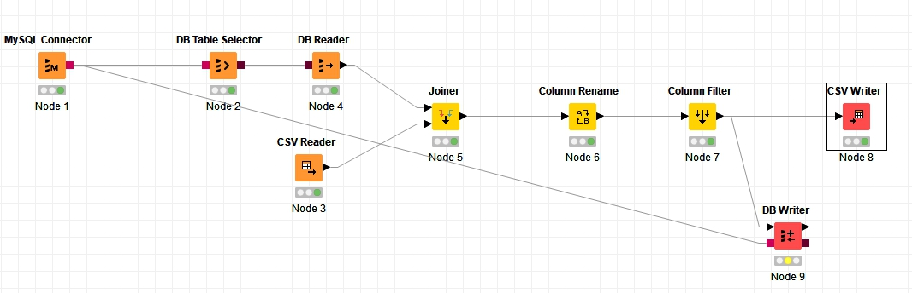

# ETL Knime

## 1. Penjelasan Dataset
Dataset yang digunakan adalah Formula 1 Race Data (https://www.kaggle.com/cjgdev/formula-1-race-data-19502017). Dataset ini berisi semua balapan Formula 1 dari tahun 1950 sampai 2017.
## 2. Business Understanding

Dataset ini berguna untuk fans Formula 1 untuk mengetahui bagaimana sejarah balapan dalam Formula 1 mulai dari tahun 1950 sampai tahun 2017. Kemungkinan yang dapat dilakukan adalah sebagai berikut

- Melihat pembalap mana saja yang menyelesaikan balapan dan mana yang tidak
- Melihat sirkuit apa yang dipakai selama Grand Prix
- Melihat kedudukan para pembalap untuk setiap musimnya
- Melihat kapan pembalap melakukan pit stop selama balapan

## 3. Data Understanding
Dataset ini terdiri dari 13 table. Table tersebut adalah sebagai berikut.

- Circuits (Berisi daftar sirkuit yang digunakan selama Formula 1. Dalam tabel circuits, terdapat nama sirkuit, lokasi sirkut, negara sirkuit, koordinat sirkuit dan link wikipedia dari sirkuit yang bersangkutan. Terdiri dari 73 baris.) 
- Constructor Result (Berisi hasil dari balapan beserta poin yang diraih masing-masing konstruktor selama balapan. Terdiri dari 11142 baris)
- Constructors (Berisi daftar dari konstruktor yang berpartisipasi dalam Formula 1. Dalam tabel constructor terdapat nama dan kebangsaan dari masing-masing konstruktor beserta link wikipedia dari konstruktor yang bersangkutan. Terdiri dari 208 baris)
- Constructor Standing (Berisi kedudukan dari masing-masing konstruktor yang berpartisipasi dalam Formula 1 beserta poin dan kemenangan yang diraih. Terdiri dari 11896 baris)
- Drivers (Berisi daftar dari pembalap yang mengikuti Formula 1. Dalam tabel Driver terdapat nama lengkap, kode nama, tanggal lahir, kebangsaan beserta link wikipedia dari pembalap yang bersangkutan. Terdiri dari 842 baris)
- Driver Standing (Berisi kedudukan dari masing-masing pembalap selama balapan beserta posisinya dan jumlah kemenangan yang didapat. Terdiri dari 31726 baris)
- Lap Times (Berisi waktu lap dari masing-masing pembalap dari setiap balapan. Terdiri dari 426633 baris)
- Pit Stops (Berisi daftar pit spots yang dilakukan pembalap dalam Formula 1. Terdiri dari 6251 baris)
- Qualifying (Berisi hasil dari sesi kualifikasi dalam Formula 1 yang diraih masing-masing pembalap. Terdiri dari 7516 baris)
- Races (Berisi daftar balapan dari Formula 1. Terdapat tahun diselenggarakan, ronde, nama balapan, tanggal balapan dan waktu diselenggarakan balapan beserta link wikipedia dari balapan yang bersangkutan. Terdiri dari 997 baris)
- Results (Berisi hasil dari balapan yang diraih masing-masing pembalap. Terdiri dari 23777 baris)
- Seasons (Berisi daftar dari musim Formula 1 beserta link Wikipedianya. Terdiri dari 69 baris)
- Status (Berisi daftar status. Terdiri dari 134 baris)

## 4. Data Preparation
Untuk data preparation ini, saya akan melihat di mana sirkuit untuk masing-masing balapan diselenggarakan. Oleh karena itu, saya hanya mengambil *races.csv* dan *circuits.csv* sebagai sumber dataset. Untuk *races.csv*, datanya diimport ke dalam database. Sedangkan untuk *circuits.csv*, datanya tetap dalam format csv.

## 5. Modeling

Untuk konfigurasi dari MySQL Connector adalah seperti di bawah berikut.
![MySQL Connector](pics/mysqlconfig.jpg "mysqlconfig"_